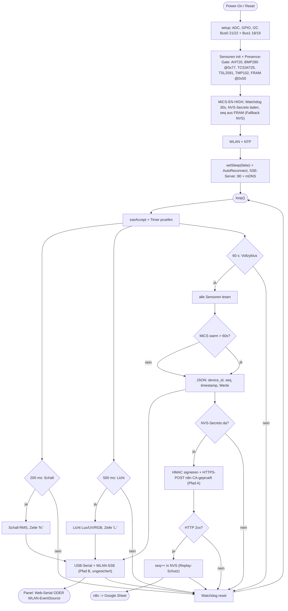

# Logik-Flussdiagramm — Umweltmonitor-Basismodul (Firmware v1)

Rendert in jedem Mermaid-fähigen Viewer (GitHub, VS Code + Mermaid-Extension, https://mermaid.live).
Stand 2026-06-25: inkl. **Echtzeit-Streams** (`N:`/`L:`) und **WLAN-Live-Stream (SSE)** — beides neben dem signierten 60-s-POST.

## Zwei getrennte Datenwege
- **Pfad A — signierter HTTPS-POST → n8n (1×/min):** HMAC-SHA256 über den exakten JSON-Body, CA-geprüftes HTTPS (kein `setInsecure()`). `seq` zählt **nur bei HTTP 2xx** hoch (monoton, NVS-persistent → Replay-Schutz). Braucht provisionierte `url`+`hmac`.
- **Pfad B — lokaler Live-Stream (Echtzeit):** `N:` (~5 Hz Schall) und `L:` (~2 Hz Licht) plus die 1-min-JSON gehen über **USB-Serial UND WLAN-SSE** (Port 80, `umweltmonitor.local`, CORS offen) direkt ans Panel. **Ungesichert** — nur fürs lokale WLAN gedacht, NICHT der signierte Pfad A.

## Weitere Kernpunkte
- **MiCS-Warmup:** erste ~60 s `gas_raw=null`, bis der MOS-Sensor warm ist.
- **WLAN-Stabilität:** `setSleep(false)` (kein Modem-Sleep) + Auto-Reconnect → weniger Stream-Drops.
- **Presence-Gating:** jeder I²C-Sensor wird vor `begin()` per ACK geprüft → kein Crash bei fehlendem Gerät.
- **Kein Deep-Sleep** (Netzbetrieb); durchgehender Takt per `millis()`. USB-Serial schläft nie.
