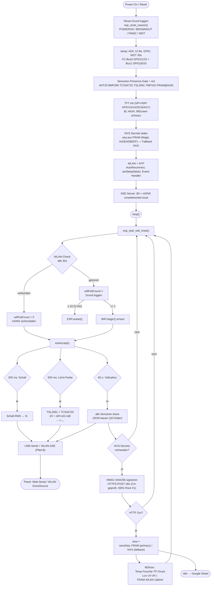

# Logik-Flussdiagramm — Umweltmonitor-Basismodul (Firmware v1)

Stand 2026-06-27. Rendert in jedem Mermaid-fähigen Viewer (GitHub, VS Code + Mermaid-Extension, https://mermaid.live).

## Datenwege

- **Pfad A — signierter HTTPS-POST → n8n (1×/min):** HMAC-SHA256, CA-geprüftes HTTPS. `seq` steigt nur bei HTTP 2xx (Replay-Schutz). Braucht NVS-Secrets (`url` + `hmac`). *Noch nicht aktiv — Provisioning ausstehend.*
- **Pfad B — lokaler Live-Stream (Echtzeit):** `N:` (~5 Hz Schall), `L:` (~2 Hz Licht+dV) und 1-min-JSON über USB-Serial **und** WLAN-SSE (Port 80, CORS offen). Ungesichert — nur lokales WLAN.

## Kernpunkte

- **Reset-Grund:** `esp_reset_reason()` bei jedem Boot → POWERON/BROWNOUT/PANIC/TASK_WDT/SW_RESET. Diagnose bei Ausfällen.
- **WLAN-Watchdog:** nach 5 min ohne WLAN → `ESP.restart()`. Disconnect-Grund (Code + Text) geloggt.
- **FRAM-Persistenz:** seq-Zähler in MB85RC256V (0x50, Magic 0xDEADBEEF). NVS nur wenn kein FRAM.
- **TFT-Display:** 1×/min aktualisiert nach Messzyklus. Lux/UV/dV, Status-Zeile (FRAM/WLAN/Uptime).
- **Farbvarianz dV:** Summe |ΔR|+|ΔG|+|ΔB| zwischen TCS34725-Messungen (500ms). Lichtdynamik-Indikator.
- **Presence-Gating:** I²C-ACK vor jedem `dev.begin()` → kein Crash bei fehlendem Gerät.
- **MiCS-Warmup:** erste ~3 min `gas_raw=null`.
- **Kein Deep-Sleep** (Netzbetrieb), durchgehender Takt per `millis()`.
